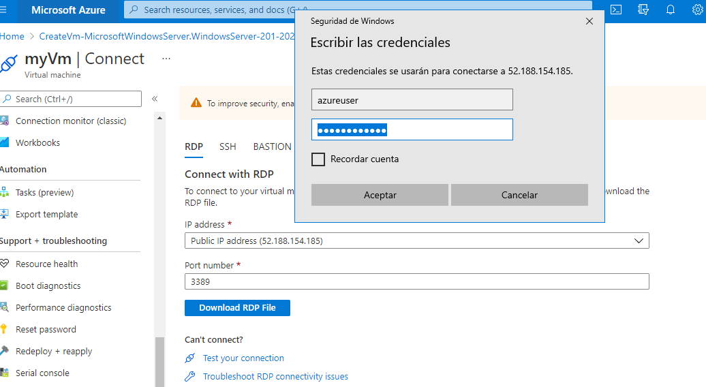
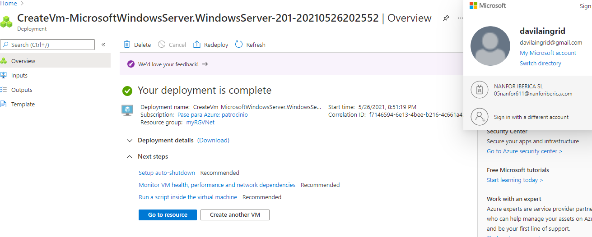
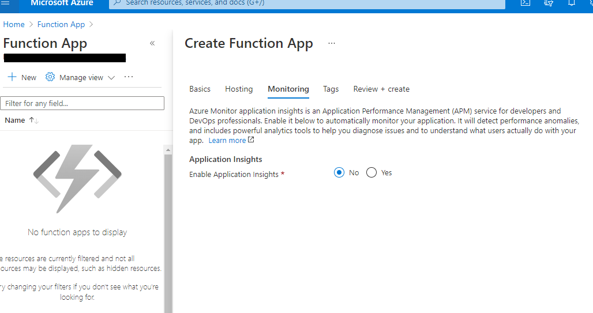
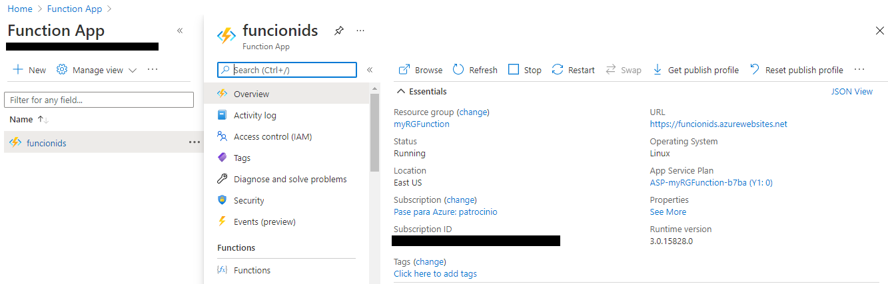
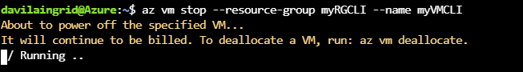
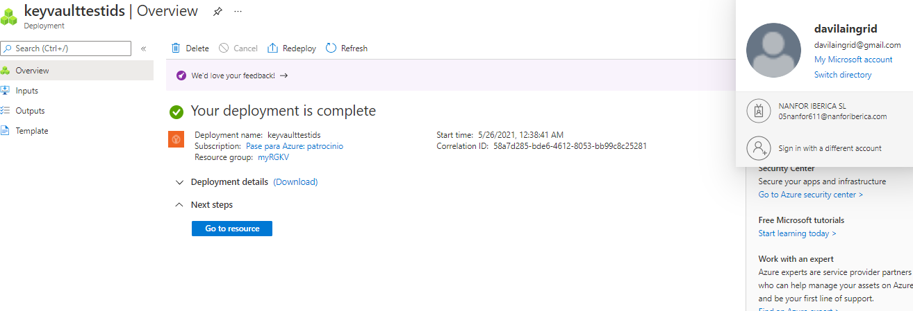
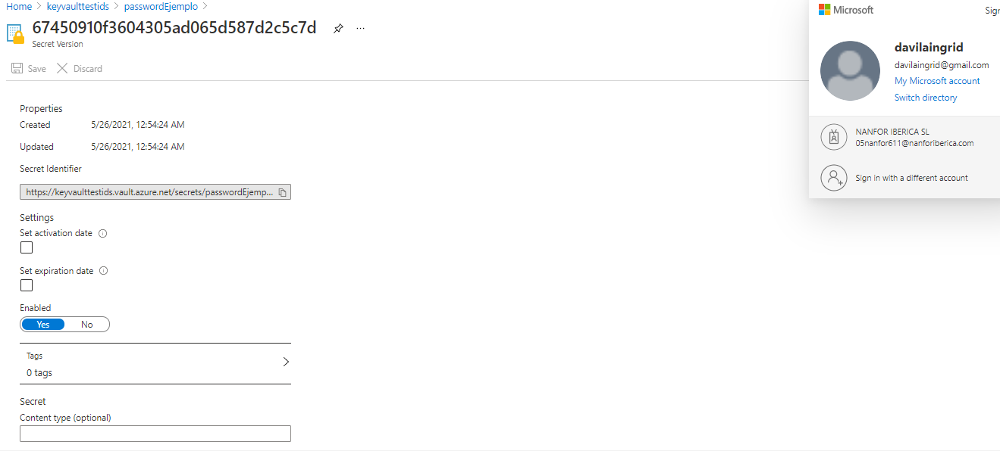
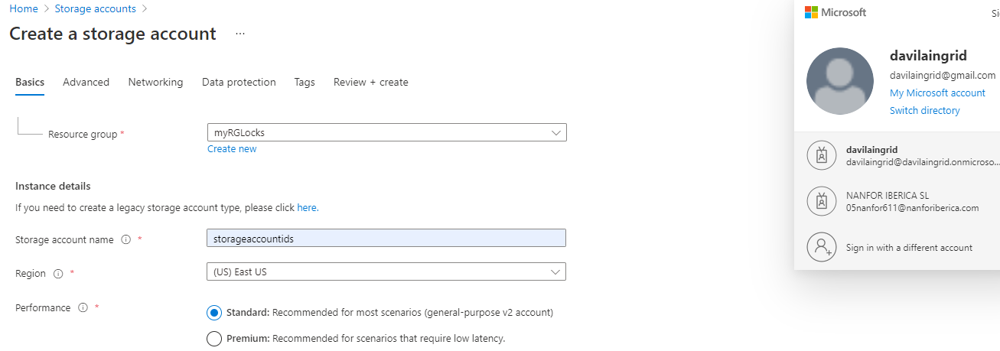
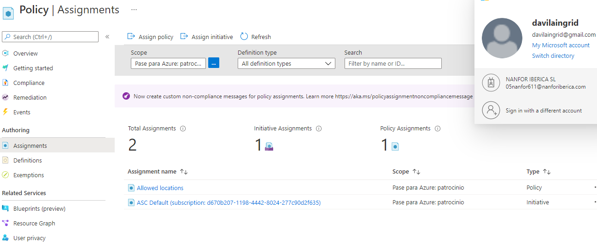

# 01 - Crear una máquina virtual en el portal

# 02 - Crear una aplic. web

# 03 - Implementación de Azure Container Instances

# 04: Crear una red virtual

# 

# 05 - Crear almacenamiento de blobs

# 06 - Crear una base de datos SQL

# 07 - Implementar un Azure IoT Hub

# 08 - Implementar Azure Functions

# 09: Crear una máquina virtual con una plantilla

# 

# 10 - Crear una VM con PowerShell

# 11 - Crear una VM con la CLI

# 12 - Implementar Azure Key Vault

# 13 - Tráfico de red segura

# 14: Administrar el acceso con RBAC

# 15 - Administrar bloqueos de recursos

# 16 - Implementar etiquetado de recursos

# 17: Crear una directiva de Azure

# 18 - Explorar el Centro de confianza

# 19 - Usar la calculadora de precios

# 20 - Usar la calculadora de TCO de Azure

