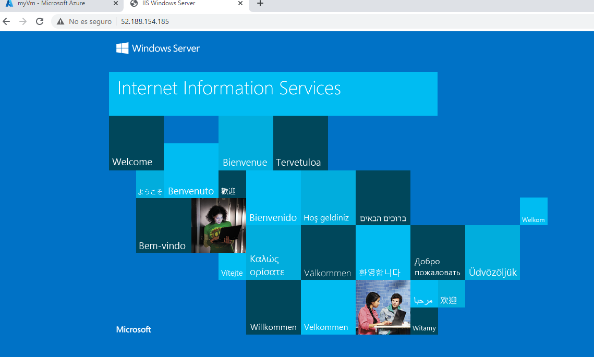
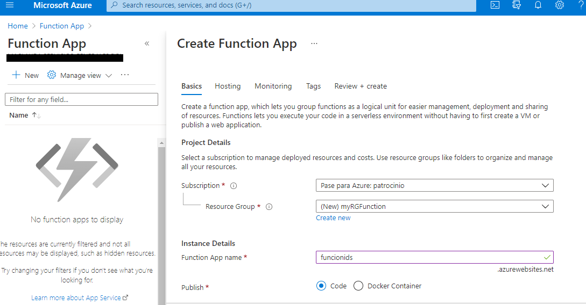
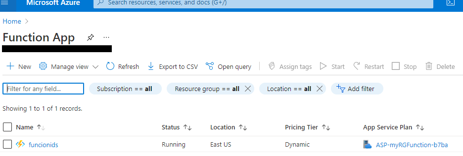
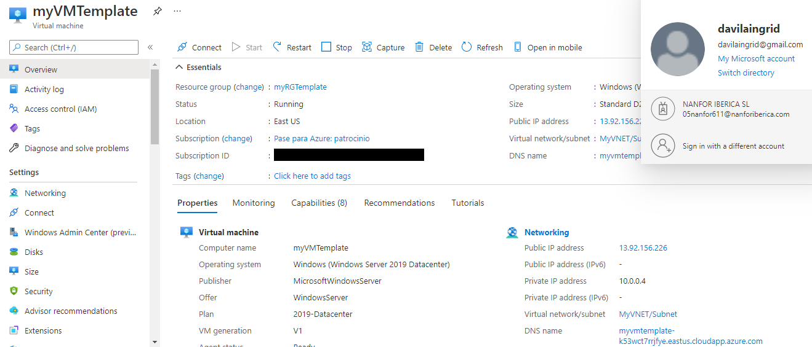
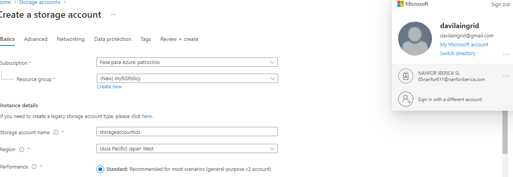

# 01 - Crear una máquina virtual en el portal

# 02 - Crear una aplic. web

# 03 - Implementación de Azure Container Instances

# 05 - Crear almacenamiento de blobs

# 06 - Crear una base de datos SQL

# 08 - Implementar Azure Functions

# 09: Crear una máquina virtual con una plantilla

# 

# 17: Crear una directiva de Azure

