**01 - Crear una máquina virtual en el portal**

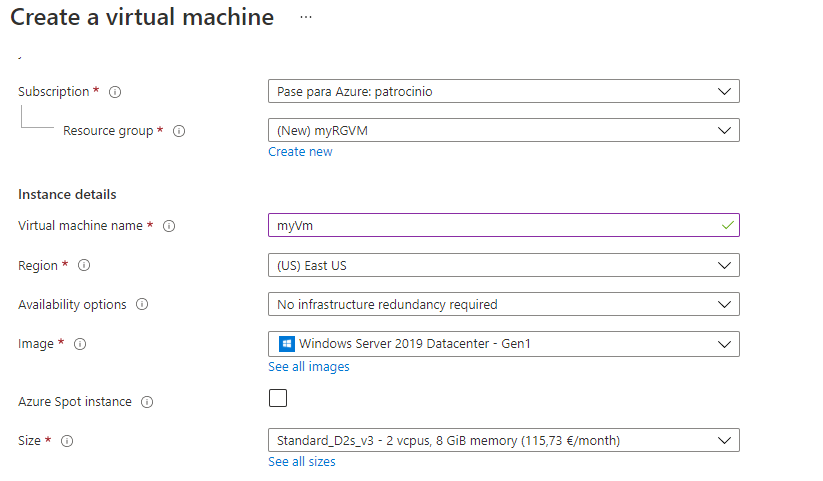

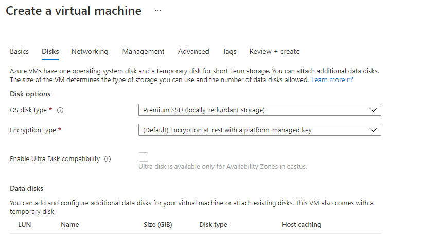

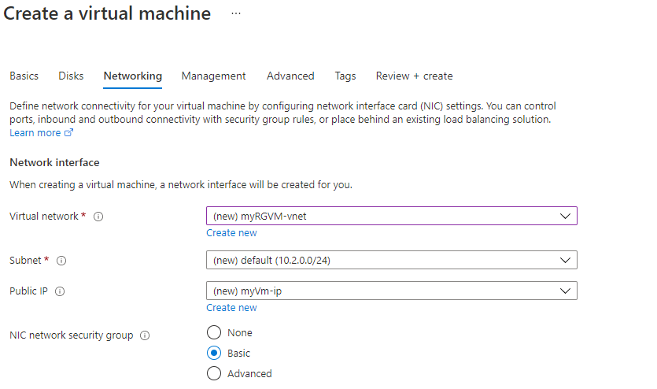

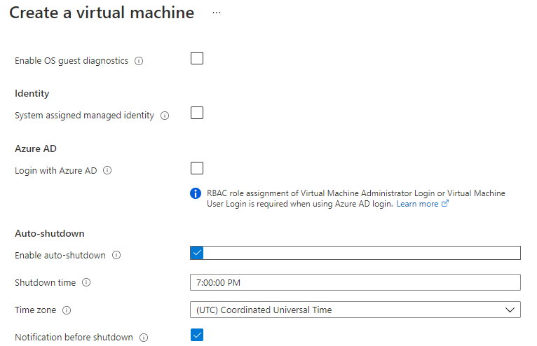

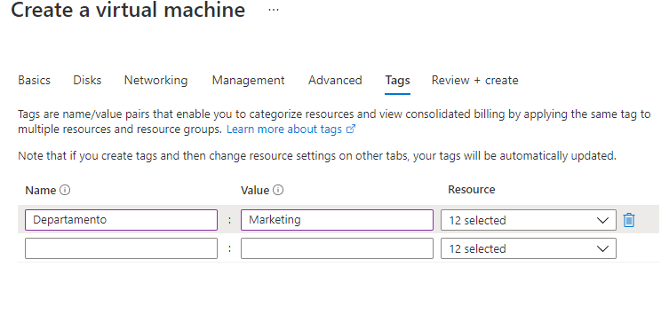

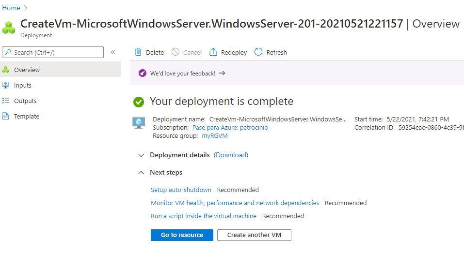

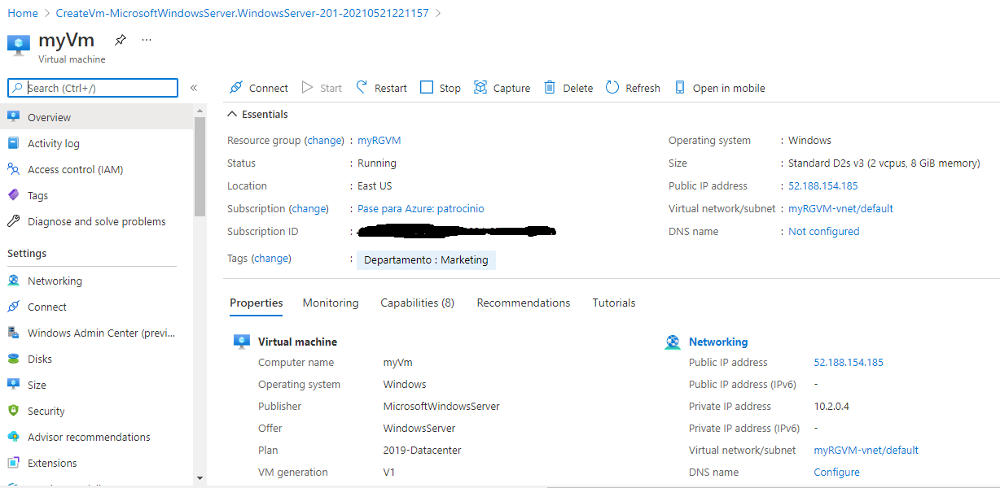

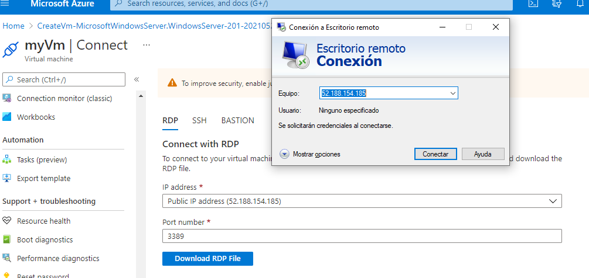

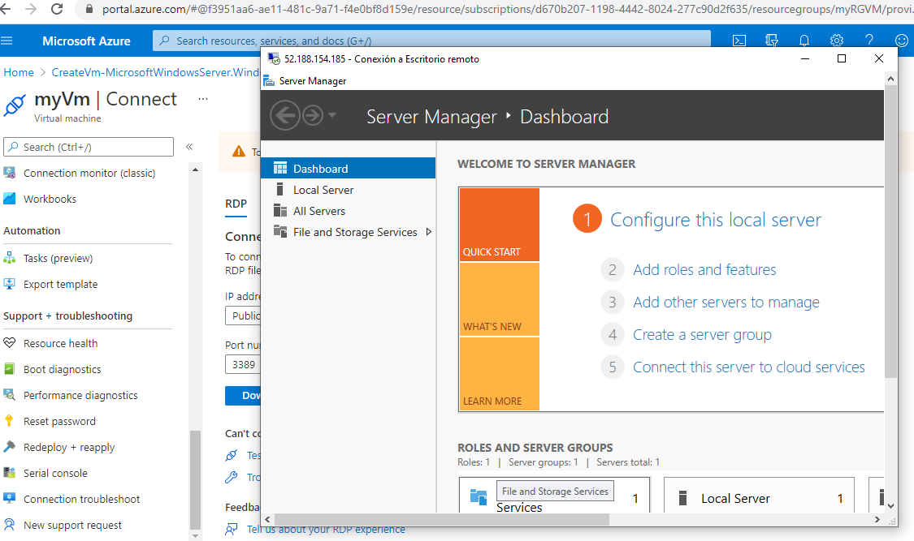

**02 - Crear una aplic. web**

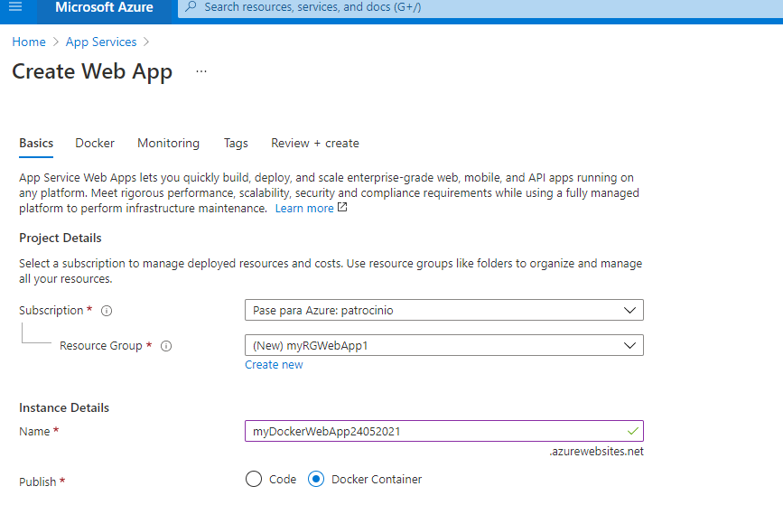

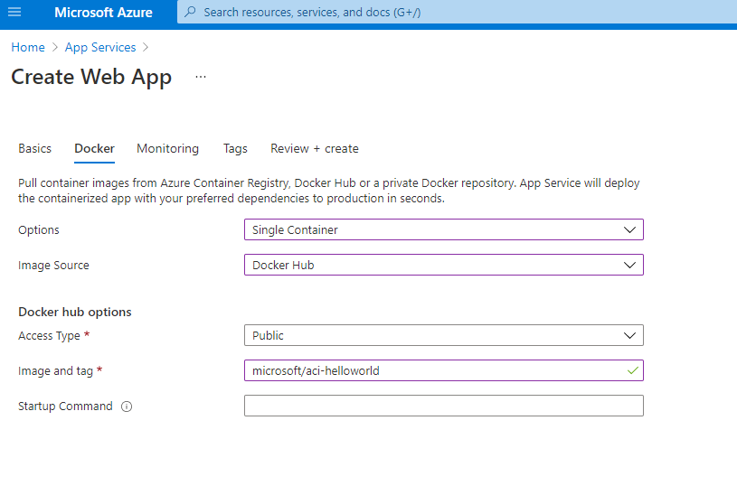

**03 - Implementación de Azure Container Instances**

# 05 - Crear almacenamiento de blobs

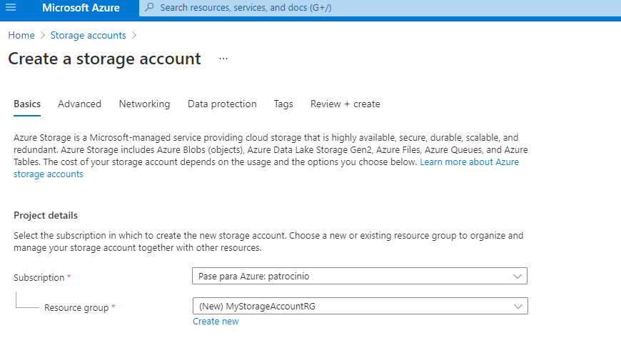

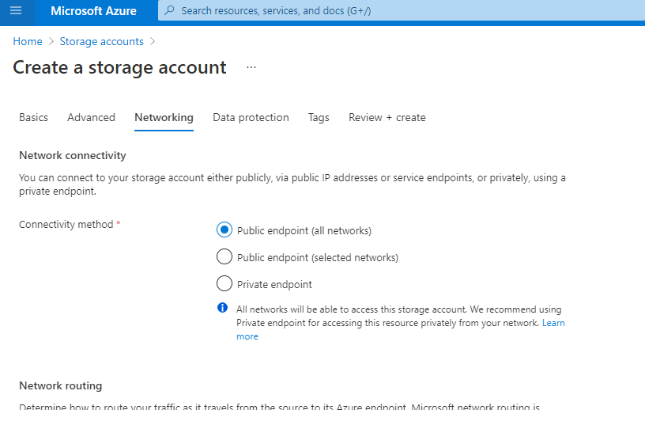

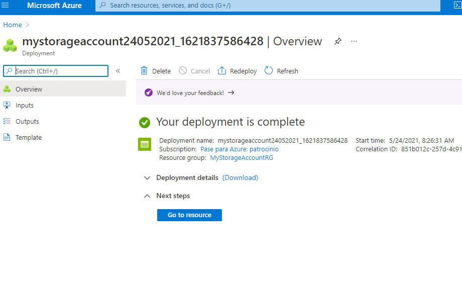

